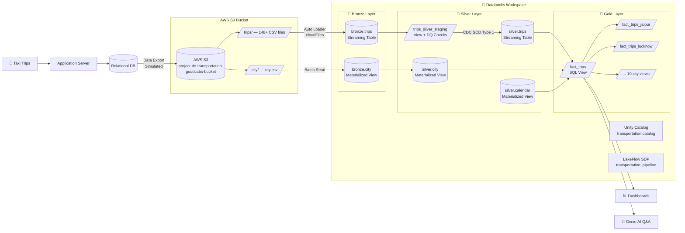

# 🚖 GoodCabs — End-to-End Data Engineering Pipeline on Databricks


## 📌 Project Overview

A **production-style, end-to-end Data Engineering pipeline** built on **Databricks Free Edition** for **GoodCabs** — a fast-growing cab service operating across 10 Indian cities.

The pipeline ingests raw trip data from **AWS S3**, processes it through a **Medallion Architecture (Bronze → Silver → Gold)** using **LakeFlow Spark Declarative Pipelines**, and delivers clean, city-specific analytical views for business consumption.

> **Data Volume:** 148 daily trip CSV files (~19.5 MB total) + 5 incremental files manually uploaded to S3 to validate trigger-based pipeline execution.

---

## 🧩 Business Problem

Regional managers at GoodCabs were:
- **Not receiving trip data on time**
- Using **generic dashboards** that required manual rework per city
- Operating from a **tightly coupled, procedural Spark pipeline** that was slow to adapt

**Solution:** Replace the legacy pipeline with a declarative, streaming, auto-triggering data platform that delivers city-specific, analytics-ready datasets automatically.

---

## ✅ Solution Overview

A declarative, incrementally-updating pipeline that:

- Automatically ingests new trip files as soon as they land in S3
- Cleans, validates, and standardizes the data
- Produces one Gold-layer view per city so each regional team gets exactly the data it needs — no manual rework

---

## 🛠️ Technologies Used

| Tool | Purpose |
|---|---|
| **Databricks Free Edition** | Unified lakehouse platform |
| **LakeFlow Spark Declarative Pipelines (SDP)** | Orchestrated pipeline framework |
| **PySpark** | Data transformation |
| **Delta Lake** | ACID-compliant storage with CDC |
| **Auto Loader** | Incremental S3 file ingestion |
| **AWS S3** | Raw data storage (`s3://goodcabs/data-store/`) |
| **Unity Catalog** | Data governance (`transportation` catalog) |
| **SQL** | Gold layer views |
| **Databricks Genie** | AI-powered data Q&A on `fact_trips` |

---

## 🏗️ Architecture Diagram


### Mermaid Diagram


---

## ⚙️Medallion Architecture

### 🥉 Bronze — Raw Ingestion Layer

| Table | Type | Description |
|---|---|---|
| `transportation.bronze.trips` | Streaming Table | Raw trip CSVs via Auto Loader. Column rename: `distance_travelled(km)` → `distance_travelled_km`. Adds `file_name`, `ingest_datetime`. |
| `transportation.bronze.city` | Materialized View | Static city lookup batch-read from S3 CSV. |

**Properties on all Bronze tables:** CDF enabled, auto-optimize, auto-compact, PERMISSIVE read mode.


### 🥈 Silver — Clean & Validated Layer

| Table | Type | Description |
|---|---|---|
| `transportation.silver.trips` | Streaming Table (CDC) | Validated, deduplicated, SCD Type 1 upserted trips. |
| `transportation.silver.city` | Materialized View | Clean city dimension with timestamps. |
| `transportation.silver.calendar` | Materialized View | Date dimension (2025): 17 attributes + Indian holidays. |

**Data Quality Rules (declarative, on staging view):**
```python
@dp.expect("valid_date",             "year(business_date) >= 2020")
@dp.expect("valid_driver_rating",    "driver_rating BETWEEN 1 AND 10")
@dp.expect("valid_passenger_rating", "passenger_rating BETWEEN 1 AND 10")
```


### 🥇 Gold — Analytics-Ready Layer

| View | Description |
|---|---|
| `fact_trips` | Master view: trips + city + calendar JOIN |
| `fact_trips_jaipur` | City-filtered view (RJ01) |
| `fact_trips_lucknow` | City-filtered view (UP01) |
| `fact_trips_chandigarh` | City-filtered view (CH01) |
| *(+ 7 more city views)* | One view per city |

---

## 📁 Project Structure

```
goodcabs-databricks-pipeline/
│
├── data/
│   ├── city/
│   │   └── city.csv                    # 10 Indian cities lookup
│   └── trips/
│       ├── Full Load/                   # 148 daily trip files (~19.5 MB)
│       └── Incremental Load/            # 5 files to test pipeline trigger
│
├── notebooks/
│   └── project_setup.ipynb             # Unity Catalog + Schema setup
│
└── pipeline/
    ├── bronze/
    │   ├── city.py                     # Batch ingestion (Materialized View)
    │   └── trips.py                    # Streaming ingestion (Auto Loader)
    ├── silver/
    │   ├── city.py                     # City dimension cleaning
    │   ├── trips.py                    # CDC + SCD Type 1 upsert
    │   └── calendar.py                 # Calendar dimension (17 attributes)
    └── gold/
        ├── trips_gold.sql              # fact_trips master view
        └── trips_{city}.sql × 10      # City-specific views
```
## ✅ Data Quality Checks

Declared using `@dp.expect` on the Silver trips staging view:

| Rule | Expectation |
|---|---|
| `valid_date` | `year(business_date) >= 2020` |
| `valid_driver_rating` | `driver_rating BETWEEN 1 AND 10` |
| `valid_passenger_rating` | `passenger_rating BETWEEN 1 AND 10` |
---

## 📸 Project Snaps

#### 1. Pipeline DAG- Full DAG in Databricks: bronze → silver → gold → city views


#### 2. S3 Bucket- `project-de-transportation-goodcabs-bucket` in AWS us-east-1


#### 3. Genie AI Query- Average driver rating by city using natural language


## 📊 Business Insights / Output


---

## 💡 Key Learnings

- LakeFlow SDP automatically resolves DAG execution order — no manual orchestration code
- `@dp.materialized_view` (batch) vs `@dp.table` (streaming) — each has specific use cases
- Auto Loader checkpoint ensures exactly-once ingestion for incremental files
- `dp.create_auto_cdc_flow()` replaces complex MERGE INTO logic with a single function call
- Delta Lake CDF allows downstream consumers to process only rows that changed
- Unity Catalog enforces catalog.schema.table namespace across the entire workspace

---


## 🧪 How to Run the Project

### Prerequisites
- Databricks Free Edition account (no credit card needed)
- AWS account with an S3 bucket
- S3 bucket connected to Databricks workspace

### Steps

```bash
# Step 1: Setup Unity Catalog
# Run notebooks/project_setup.ipynb
# Creates: transportation catalog → bronze, silver, gold schemas

# Step 2: Upload data to S3
# city.csv  → s3://your-bucket/data-store/city/
# trip CSVs → s3://your-bucket/data-store/trips/

# Step 3: Create Pipeline in Databricks
# Jobs & Pipelines → Create Pipeline → Add all files from pipeline/
# Set config: start_date = 2025-01-01 | end_date = 2025-12-31

# Step 4: Run the pipeline
# Click "Start" → All layers populate automatically

# Step 5: Execute Gold SQL views
# Run gold/*.sql in Databricks SQL Editor

# Step 6: Explore with Genie
# Open fact_trips in Catalog → Sample Data → Ask + Run
```

---

## 👤 Contact

**Aniket Andhale**

🔗 [LinkedIn](#) | [GitHub](#)

